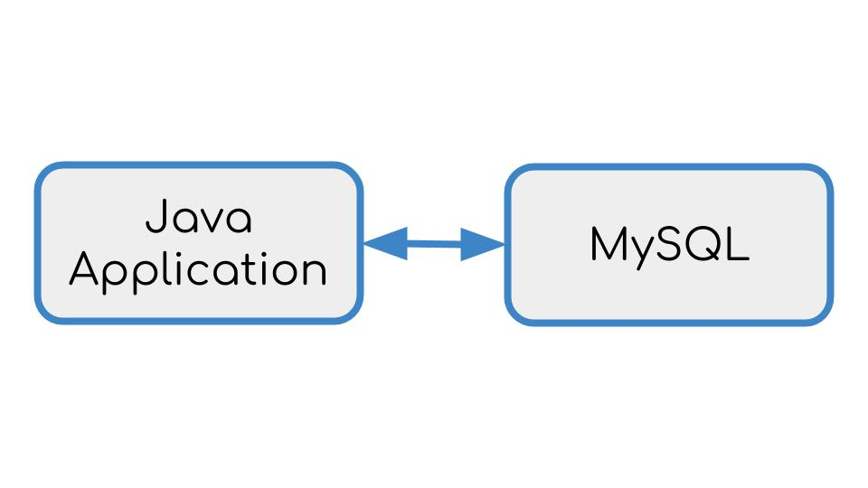

# Signup Application

The Signup application is a basic Java CRUD (Create, Read, Update, Delete) application that uses Spring and Hibernate to transact queries against MySQL. 



##  Building the Application

The application and database are built and deployed in Docker containers using Dockerfiles.

The Java application uses a multi-stage build to create the application and deploy it to a Tomcat application server. The multi-stage build uses a Maven container to build the application. The pom.xml file is copied to the Maven container and Maven downloads the application dependencies. Once the dependencies are downloaded, Maven compiles that application which includes both the servlet and the Java Server Pages client. After compiling the code, Maven packages the application into a Web Archive or WAR file.

```
FROM maven:latest AS devenv
WORKDIR /usr/src/java-app 
COPY app/pom.xml .
RUN mvn -B -f pom.xml -s /usr/share/maven/ref/settings-docker.xml dependency:resolve
COPY ./app .
RUN mvn -B -s /usr/share/maven/ref/settings-docker.xml package -DskipTests
```
The next step is to deploy the WAR file to a Tomcat container. Before deploying the WAR file, Tomcat is configured with the requisite jar and configuration files. Finally the WAR file is copied to the Tomcat `./webapps` directory and the container is ready for deployment.

```
FROM tomcat:7-jre8
LABEL maintainer="Sophia Parafina <sophia.parafina@docker.com>"

# tomcat-users.xml sets up user accounts for the Tomcat manager GUI
ADD tomcat/tomcat-users.xml $CATALINA_HOME/conf/

# ADD tomcat/catalina.sh $CATALINA_HOME/bin/
ADD tomcat/run.sh $CATALINA_HOME/bin/run.sh
RUN chmod +x $CATALINA_HOME/bin/run.sh

# add MySQL JDBC driver jar
ADD tomcat/mysql-connector-java-5.1.36-bin.jar $CATALINA_HOME/lib/

# create mount point for volume with application
WORKDIR $CATALINA_HOME/webapps/
COPY --from=devenv /usr/src/java-app/target/java-web.war .

# add tomcat jpda debugging environmental variables
#ENV JPDA_OPTS="-agentlib:jdwp=transport=dt_socket,address=8000,server=y,suspend=n"
ENV JPDA_ADDRESS="8000"
ENV JPDA_TRANSPORT="dt_socket"

# start tomcat7 with remote debugging
EXPOSE 8080
CMD ["run.sh"]
``` 

To build the application:
```
docker image build -t java-app .
```

## Running the Application

To deploy both the application and the database, we use a Docker Compose file. MySQL requires a root password and this set using Docker Secrets. In this case the password is set from a file. Docker Secrets is available in Swarm mode, to enable Swarm type:
```
docker swarm init
```

To start the application user Docker Compose:
```
docker-compose up -d
```

To try out the application go to [http://localhost:8080/java-web](http://localhost:8080/java-web).
